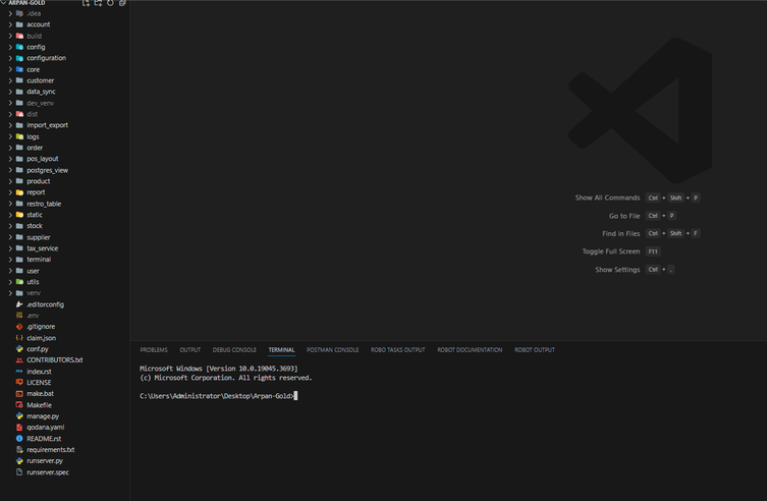

Dependencies:
============
- Django==3.2
- django-cors-headers==3.11.0
- django-filter==21.1
- django-graphql-jwt==0.4.0
- django-model-utils==4.2.0
- django-mptt==0.13.4
- django-timezone-field==5.0
- graphene-django==2.15.0
- graphene-file-upload==1.3.0
- graphql-core==2.3.2
- graphql-relay==2.0.1
- openpyxl==3.0.9
- phonenumbers==8.12.39
- Pillow==10.0.0
- psycopg2-binary==2.9.6
- pyinstaller==5.13.0
- pyjnius==1.5.0
- PyJWT==2.8.0
- python-dateutil==2.8.2
- requests==2.31.0

Build System:
============
1. setuptools
2. pip

Package Management:
==================
- pip

Document Generation:
===================
- Sphinx

Testing Framework:
=================
- Pytest
- UnitTest

Continuous Integration(CI):
==========================
- Not Used 

Code Coverage:
=============
- coverage.py

Code Analysis and Linting:
=========================
- PEP-8

Versioning:
==========
- Semantic Versioning
    1. format: Major.Minor.Patch
    2. Example: 11.1.2

Branching Strategy:
==================
- Develop Branch
- Feature Branch 

Contributing Guidelines:
=======================
Contributing guidelines are crucial for creating a collaborative and efficient
development environment. They help contributors understand how to contribute 
to a project, maintain consistency, and facilitate a smooth review and 
integration process. Below are guidelines for contributors, including steps on
how to fork, branch, and submit pull requests:

Forking the Repository:
-----------------------
1. Fork the Repository:
    - Click on the "Fork" button on the GitHub repository to create a copy of the 
      repository under your GitHub account.

2. Clone the Forked Repository:
    - Clone the forked repository to your local machine using the following command:
      git clone https://github.com/your-username/repository.git

Creating a Feature Branch:
--------------------------
1. Create Branch
    - Create a new branch for your contribution. Use a clear and descriptive branch name 
      related to the feature or bug you are addressing:
      git checkout -b feature/new-feature

Making Changes:
---------------
1. Make Changes:
    - Implement the necessary changes or additions.
    - Follow coding conventions, style guidelines, and any project-specific rules.

Committing Changes:
------------------
1. Commit Changes:
    - Commit your changes with a clear and concise commit message:
      git commit -m "Add Ticket Number Add feature: description of the feature"

Keeping Your Fork Updated:
-------------------------
1. Sync with the Upstream Repository:  
    - To keep your fork up to date with the original repository, add the upstream 
      repository:
      git remote add upstream https://github.com/original-owner/repository.git

    - Fetch changes from the upstream repository and merge them into your local branch:
      git fetch upstream
      git merge upstream/main

Submitting a Pull Request:
-------------------------
1. Push Changes:
    - Push your changes to your fork on GitHub:
      git push origin feature/new-feature

2. Create a Pull Request:
    - Go to your fork on GitHub and create a new pull request.
    - Provide a clear title and description for your pull request, explaining the purpose of the changes.

3. Follow Code Review:
    - Be responsive to feedback and be prepared to make additional changes if required.
    - Address comments and update your pull request branch as needed.

4. Squash Commits (if requested):
    - If the maintainers request a single, clean commit, squash your commits into one before merging.

Review and Merge:
----------------
1. Code Review:
    - The project maintainers will review your pull request.
    - Address any additional feedback and make changes if necessary.
2. Merge:
    - Once your pull request is approved, it will be merged into the main branch.

Code Review Process:
===================

Testing Instructions:
====================
1. Install Dependencies:
    - Make sure you have Python installed on your system.
    - Install project dependencies by running:
      pip install -r requirements.txt

Run Unit Tests:
---------------
1. Navigate to the Project Directory:
    Open a terminal and navigate to the root directory of the project:
    cd path/to/project

2. Run Tests:
    - Run all unit tests using the following command:
      pytest
    - To run tests for specific modules or directories:
      pytest path/to/tests
    - Additional pytest options, such as -k for selecting specific tests, can be used as needed.

Code Organization:
==================

- restro_table: Django application for restaurant table
- static: Foder used by django to store static files.
- stock: Django application to maintain stock.
- supplier: Django application for supplier
- tax_service: Django application for tax and service charges
- terminal: Django application for terminal
- user: Django application for user
- utils: Normal folder to store utility functions, classes, e.t.c
- venv: This is also virtual environment. This is used during the time of development
- .editor_config: This file is responsible to maintain code like spaces and table across multiple editor.
- .env: This file is used to store secret data
- .gitignore: This file is used by git to ignore files and folder
- conf.py, index.rst, make.bat, Makefile: This file is automatically generated by sphinx. Welcome — Sphinx documentation (sphinx-doc.org)
- manage.py: This file is generated by django
- qodana.yaml: This file is generated by qodana, maintained by pycharmQodana Cloud
- README.rst: This file contains basic info about project
- requirments.txt: This file contains packages used inside this project
- runserver.py: This is custom version or manage.py file used for buding this project using pyinstaller to generate exe.
- runserver.spec: This file is automatically generated by pyinstallerPyInstaller Manual — PyInstaller 6.2.0 documentation

IDE configuration:
=================
- Not Specific

Developement Workflow:
======================

Acknowledgments:
================
We would like to express our gratitude to the following individuals, teams, and projects for their contributions to this project:

Contributors:
------------

- Ramesh Sharma : Provided Design for complete development.
- Sandeep Kushuwa : Provided significant contributions in Backend Developement.
- Prajwal Sapkota : Provided significant contributions in Backend Developement.
- Prince Sapkota : Helped improve Code and Bugs.
- Subham Bhatta : Contributed as a Project Manager.

Third-Party Libraries and Tools:
--------------------------------

- [Python](https://www.python.org/): The programming language used for the back-end development.
- [Django](https://www.djangoproject.com/): A high-level Python web framework that encourages rapid development and clean, pragmatic design.
- [React](https://reactjs.org/): A JavaScript library for building user interfaces.
- [Graphene-Django](https://docs.graphene-python.org/projects/django/en/latest/): A Django integration for Graphene, a GraphQL library for Python.
- [Electron](https://www.electronjs.org/): A framework for building cross-platform desktop applications using web technologies.

We appreciate the open-source community and the countless developers who share their knowledge and work to make projects like ours possible.